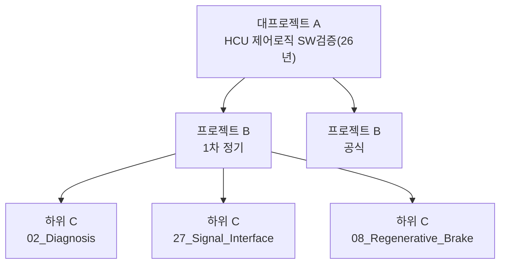
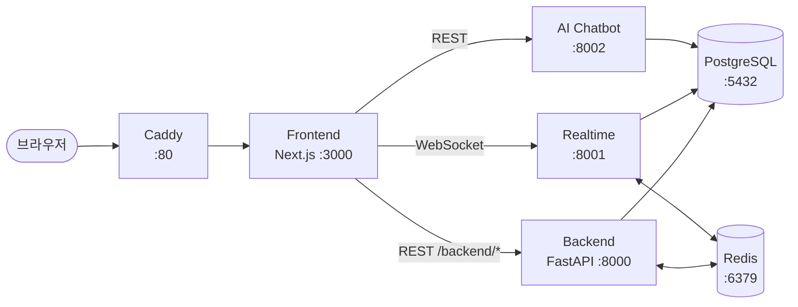

# SureLog AI

사내 업무 협업 도구. **HCU HILS 검증 업무** 흐름에 맞춰 대·중·하위 3단계로 일감을 추적합니다.

FastAPI · Next.js 15 · PostgreSQL 16 · Docker Compose

> [!TIP]
> 처음이라면 [Windows 배포 가이드](./DEPLOY_GUIDE_WINDOWS.md)부터 보세요. 전체 문서는 [docs/](./docs/README.md)에 있습니다.

---

## 목차

| 바로가기 | |
|---|---|
| [프로젝트 구조](#프로젝트-구조) | 대·중·하위 3단계가 무엇인지 |
| [주요 기능](#주요-기능) | 진행률, 검증 시간, 화면 구성 |
| [서비스 구성](#서비스-구성) | 6개 서비스와 통신 방식 |
| [폴더 구조](#폴더-구조) | 어느 파일이 무엇을 하는지 |
| [Quick Start](#quick-start) | 5분 안에 띄우기 |
| [개발 규칙](#개발-규칙) | 기여 전에 읽을 것 |

---

## 프로젝트 구조

일감을 세 단계로 나눕니다.



| 단계 | 무엇인가 | 예시 |
|---|---|---|
| **대프로젝트 (A)** | 연 단위 묶음. 템플릿이 여기에 붙습니다 | `HCU 제어로직 SW검증(26년)` |
| **프로젝트 (B)** | 차수 | `1차 정기`, `공식` |
| **하위 프로젝트 (C)** | 기능 하나. 실제 검증 단위 | `02_Diagnosis` |

---

## 주요 기능

<details open>
<summary><strong>프로젝트 관리</strong></summary>

- 유형 5종: 공식 검증 / 정기 검증 / 변경점 검증 / 기타 업무 / 일반
- 템플릿은 대프로젝트 단위로 만들어 재사용합니다. 필드를 직접 추가·삭제하고 가중치를 줄 수 있습니다
- 프로젝트 복사로 같은 구성을 통째로 다시 씁니다
- CSV로 하위 프로젝트를 한 번에 가져오고, 결과를 xlsx·csv로 내보냅니다

</details>

<details open>
<summary><strong>진행률과 시간</strong></summary>

> [!IMPORTANT]
> 하위 프로젝트 진행률은 **담당자별 최신 기록의 평균**입니다.
> 담당자가 2명일 때 한 명이 0%를 올려도, 다른 담당자의 72%가 남아 있으면 36%가 됩니다.
> 진행률 기록 창의 "담당자별 기여" 패널에서 누가 얼마를 올렸는지 확인할 수 있습니다.

- 검증·리뷰·InReview 시간은 담당자별·단계별로 남깁니다. 상위 합계는 그 기록에서 계산됩니다
- 스톱워치로 실제 소요 시간을 재고, 종료할 때 진행률을 함께 입력합니다
- 수행 이력에 어떤 검증 단계에 얼마가 들었는지 나뉘어 표시됩니다

</details>

<details>
<summary><strong>상태 표시 — 네 가지 색으로 통일</strong></summary>

| 색 | 상태 | 조건 |
|---|---|---|
| 회색 | 예정 | 기록 없음, 기한 남음 |
| 파랑 | 진행중 | 진행률 1~99% |
| 초록 | 완료 | 진행률 100% |
| 빨강 | 기한 초과 | 완료가 아닌데 종료일이 지남 |

사이드바 점, 목록 배지, 캘린더 막대, 팝오버가 모두 같은 규칙을 씁니다.
규칙은 `frontend/app/lib/subprojectStatus.ts` 한 곳에 있습니다.

</details>

<details>
<summary><strong>화면 구성</strong></summary>

| 화면 | 내용 |
|---|---|
| 대시보드 | 진행 중 업무, 오늘 마감, 활성 팀원 수, 본인 할 일 |
| 팀 캘린더 | 전체 프로젝트와 담당자별 일정. 주마다 이름과 진행률 표기 |
| 개인 캘린더 | 담당자별 필터와 체크리스트 |
| AI 업무 배정 | 과거 수행 이력 기반 담당자 추천 |
| 관리 | 사용자 권한, 인원 동기화, 대프로젝트, 템플릿, 업무 이력 |

</details>

<details>
<summary><strong>인증과 권한</strong></summary>

사번으로 로그인합니다(JWT). 관리자와 일반 직원으로 나뉩니다.

| 작업 | 관리자 | 참여 인원 |
|---|:---:|:---:|
| 프로젝트 생성·수정·삭제 | O | X |
| 하위 프로젝트 수정 | O | O |
| 진행률·검증 시간 기록 | O | O |
| 사용자 관리 | O | X |

</details>

---

## 서비스 구성



> [!NOTE]
> 평소 접속은 **http://localhost** 하나면 됩니다. 나머지 포트는 개발·디버깅용입니다.

| 서비스 | 경로 | 포트 |
|--------|------|------|
| Backend REST API | `./backend` | 8000 |
| Realtime (WebSocket) | `./realtime` | 8001 |
| AI Chatbot | `./ai-chatbot` | 8002 |
| Frontend (Next.js) | `./frontend` | 3000 |
| Caddy (리버스 프록시) | - | 80 |
| PostgreSQL 16 | - | 5432 |
| Redis 7 | - | 6379 |

**기술 스택** · FastAPI (Python 3.11), SQLAlchemy 2.0 Mapped 스타일, Pydantic v2 · Next.js 15 App Router, React 19, TypeScript, Tailwind CSS v4 · PostgreSQL 16, Redis 7 · Docker Compose (Rancher Desktop), Caddy

---

## 폴더 구조

<details>
<summary><strong>펼쳐 보기</strong></summary>

```
.
├── backend/              # FastAPI REST API
│   └── app/
│       ├── models/       # User / MajorProject / Project / SubProject / SubTask
│       │                 # ProgressLog / SubProjectTimeEntry
│       ├── schemas/      # Pydantic 스키마
│       └── routers/
│           ├── auth.py           # 로그인, 사용자 관리, 인원 동기화
│           ├── projects/         # 프로젝트 도메인 (도메인별 파일 분리)
│           └── workflow.py       # 스톱워치, 템플릿, 수행 이력
├── realtime/             # WebSocket 실시간 서버
├── ai-chatbot/           # AI 챗봇 서비스
├── frontend/
│   └── app/
│       ├── lib/          # api.ts(도메인 타입·라벨), subprojectStatus.ts(상태 색)
│       ├── components/   # 공통 UI, AppShell, 캘린더, 모달
│       ├── projects/     # 프로젝트 목록·상세
│       ├── dashboard/    # 개요
│       ├── team-calendar/ · personal-calendar/
│       └── admin/        # 관리 탭
├── database/             # 초기화 SQL, 시드 데이터
├── backups/              # DB 백업 (인원 동기화 전 자동 생성분 등)
├── docs/                 # 문서 → docs/README.md 참고
├── docker-compose.yml        # 프로덕션 구성 (source of truth)
├── docker-compose.dev.yml    # 개발 오버라이드 (코드 수정 즉시 반영)
└── .env.example
```

</details>

---

## Quick Start

> [!WARNING]
> Rancher Desktop과 WSL 2가 먼저 설치돼 있어야 합니다.
> 설치부터 필요하면 [Windows 배포 가이드](./DEPLOY_GUIDE_WINDOWS.md)를 보세요.

```powershell
# 1. 환경 변수 준비
Copy-Item .env.example .env    # 열어서 비밀번호·시크릿 키 수정

# 2. 개발 모드로 기동 (코드 수정 즉시 반영)
docker compose -f docker-compose.yml -f docker-compose.dev.yml up --build

# 3. 브라우저에서 http://localhost 접속
```

첫 사용자는 회원가입 후 관리자로 지정해야 프로젝트를 만들 수 있습니다.
실제 조직도를 한 번에 넣으려면 [인원 동기화 가이드](./docs/org-sync-guide.md)를 보세요.

---

## 개발 규칙

**브랜치** · `main_branch`가 배포 브랜치입니다. 작업 브랜치는 날짜 기준(`260915`, `260914_yhcho`)으로 만들고 PR로 머지합니다.

**기여 전에** · 서비스 경계, 검증 범위, 편집 지침은 [CLAUDE.md](./CLAUDE.md)에 있습니다.

**검증 범위** · 고친 서비스만 확인하면 됩니다.

| 고친 곳 | 실행할 것 |
|---|---|
| `frontend/` | `npm run lint`, `npx tsc --noEmit` |
| `backend/` | `pytest` |
| `realtime/` · `ai-chatbot/` | 각 폴더에서 `pytest` |
| 서비스 경계를 넘는 변경 | 양쪽 스키마 확인 후 해당 서비스 전부 |
