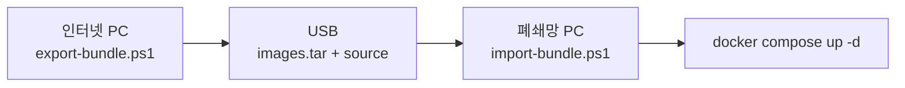

# 폐쇄망 배포 가이드

인터넷이 안 되는 망으로 옮기고, 이후 최신화하는 방법입니다.



> [!IMPORTANT]
> 폐쇄망에서는 `npm install` 과 `pip install` 이 불가능하므로 **빌드할 수 없습니다.**
> 다 만들어진 이미지를 싣고 가야 합니다. 폐쇄망에서 `docker compose build` 나
> `up --build` 를 실행하면 실패합니다. 항상 `up -d` 만 씁니다.

---

## 무엇을 싣는가

| 서비스 | 소스 마운트 | 이미지를 다시 실어야 할 때 |
|---|:---:|---|
| **frontend** | 안 함 | **소스가 바뀌면 항상.** 빌드 결과가 이미지 안에 있습니다 |
| backend | `./backend:/app` | `requirements.txt` 나 `Dockerfile` 이 바뀔 때만 |
| realtime | `./realtime:/app` | 위와 같음 |
| ai-chatbot | `./ai-chatbot:/app` | 위와 같음 |
| postgres · redis · caddy | - | 버전을 올릴 때만 |

백엔드 계열은 소스를 컨테이너에 그대로 물리므로, 파이썬 코드만 고쳤다면 파일 복사와 재시작으로 끝납니다.

| 모드 | 포함 | 크기 | 언제 |
|---|---|---|---|
| **Update** | 만든 이미지 4개 + 소스 | 약 2.7GB | 이미 설치된 폐쇄망 갱신 |
| **Full** | 위 + postgres·redis·caddy | 약 3.2GB | 빈 PC 에 처음 설치 |

---

## 1. 인터넷 PC 에서 묶음 만들기

```powershell
cd "C:\Users\USER\Desktop\KPI\2026_project_management_and_cowork_tool"
.\scripts\airgap\export-bundle.ps1
```

폐쇄망에 반영된 커밋을 알면 함께 넘겨서, 의존성이 바뀌었는지 확인받을 수 있습니다.

```powershell
.\scripts\airgap\export-bundle.ps1 -SinceRef 1cf0718
```

처음 설치용 전체 묶음은 이렇게 만듭니다.

```powershell
.\scripts\airgap\export-bundle.ps1 -Mode Full
```

만들어지는 모양입니다.

```
surelog-bundle-260915\
├── images.tar      도커 이미지
├── source\         소스 코드 (.env 제외)
└── MANIFEST.txt    날짜·커밋·이미지 목록
```

> [!NOTE]
> `.env` 는 비밀번호가 들어 있어 묶음에 넣지 않습니다.
> 폐쇄망의 기존 `.env` 를 그대로 씁니다.

USB 용량이 빠듯하면 압축합니다. 30% 정도 줄어듭니다.

```powershell
tar -czf surelog-bundle-260915.tar.gz surelog-bundle-260915
```

---

## 2. 소스 이력만 옮길 때 (git bundle)

파이썬 코드나 문서만 바뀌었다면 이미지 없이 git 번들만 옮겨도 됩니다. 수백 KB 로 끝납니다.

**인터넷 PC**

```powershell
# 폐쇄망에 반영된 커밋부터 현재까지
git bundle create main_branch_260915.bundle 1cf0718..main_branch
git bundle verify main_branch_260915.bundle
```

**폐쇄망 PC**

```powershell
cd C:\surelog
git pull D:\main_branch_260915.bundle main_branch
```

> [!WARNING]
> `git fetch ... main_branch:main_branch` 는 쓰지 마세요.
> 그 브랜치가 체크아웃돼 있으면 `refusing to fetch into branch` 로 거부됩니다.
> 체크아웃된 브랜치에 바로 받으려면 `git pull` 을 씁니다.

받은 뒤 컨테이너를 다시 올립니다.

```powershell
docker compose up -d
```

> [!IMPORTANT]
> **프론트엔드 화면은 git 번들만으로 바뀌지 않습니다.**
> 빌드 결과가 이미지 안에 들어 있기 때문입니다. 화면이 바뀌었다면 `images.tar` 도 함께 옮기세요.
> 백엔드·실시간·챗봇은 소스를 마운트하므로 git 번들만으로 반영됩니다.

---

## 3. 이미지까지 옮길 때

USB 를 꽂고 묶음 폴더를 로컬로 복사한 뒤 실행합니다.

```powershell
cd D:\surelog-bundle-260915
.\source\scripts\airgap\import-bundle.ps1 -TargetDir C:\surelog
```

스크립트가 순서대로 처리합니다.

1. 이미지 적재 (`docker load`)
2. DB 백업 (`backups\full_날짜.sql`)
3. 소스 덮어쓰기 — `.env`, `uploads`, `backups` 는 보존
4. `.env` 확인
5. `docker compose up -d`

끝나면 `http://localhost` 또는 다른 PC 에서 `http://컴퓨터이름` 으로 접속합니다.

---

## 4. 손으로 할 때 쓰는 명령어

스크립트를 쓰지 않고 직접 할 때의 순서입니다.

<details>
<summary><strong>이미지 적재</strong></summary>

```powershell
# 실어 온 이미지 넣기
docker load -i D:\surelog-bundle-260915\images.tar

# 들어왔는지 확인
docker images | Select-String "surelog"
```

</details>

<details>
<summary><strong>DB 백업 (갱신 전에 권장)</strong></summary>

```powershell
cd C:\surelog

# 전체 백업
docker compose exec -T db sh -c 'pg_dump -U "$POSTGRES_USER" -d "$POSTGRES_DB"' > backups\full_260915.sql

# 사용자 테이블만
docker compose exec -T db sh -c 'pg_dump -U "$POSTGRES_USER" -d "$POSTGRES_DB" -t users --data-only --column-inserts' > backups\users_260915.sql
```

되돌릴 때는 반대로 넣습니다.

```powershell
Get-Content backups\full_260915.sql | docker compose exec -T db sh -c 'psql -U "$POSTGRES_USER" -d "$POSTGRES_DB"'
```

</details>

<details>
<summary><strong>소스 덮어쓰기</strong></summary>

```powershell
# .env 와 업로드·백업은 빼고 복사
robocopy D:\surelog-bundle-260915\source C:\surelog /E /XF .env /XD uploads backups
```

</details>

<details>
<summary><strong>컨테이너 최신화</strong></summary>

```powershell
cd C:\surelog

# 바뀐 이미지·소스로 다시 만들기 (--build 쓰지 않음)
docker compose up -d

# 특정 서비스만
docker compose up -d --force-recreate frontend

# 상태 확인
docker compose ps

# 로그 확인 — DB 스키마 자동 반영도 여기서 보인다
docker compose logs --tail 50 backend
```

</details>

<details>
<summary><strong>정리</strong></summary>

```powershell
# 이름 없는 옛 이미지 삭제
docker image prune -f

# 어떤 이미지가 공간을 쓰는지
docker system df
```

</details>

---

## DB 스키마는 어떻게 되나

> [!TIP]
> 따로 할 일이 없습니다. 백엔드가 뜨면서 자동으로 맞춥니다.

`backend/app/main.py` 가 시작할 때 두 가지를 합니다.

- `Base.metadata.create_all()` — 새로 생긴 테이블을 만듭니다
- `ALTER TABLE ... ADD COLUMN` — 새로 생긴 컬럼을 더합니다. 이미 있으면 건너뜁니다

기존 데이터는 지우지 않습니다. 컬럼을 더하기만 합니다.

PR #62 이후 늘어난 것은 이렇습니다.

| 대상 | 내용 |
|---|---|
| `subprojects.created_by` | 만든 사람 |
| `subproject_time_entries` | 담당자별 검증 시간 (새 테이블) |
| `projects.vehicle_sets` | 차종 세트 |

반영됐는지 확인하려면 이렇게 봅니다.

```powershell
docker compose exec -T db sh -c 'psql -U "$POSTGRES_USER" -d "$POSTGRES_DB" -c "\d subproject_time_entries"'
```

---

## 잘 안 될 때

<details>
<summary><strong>"pull access denied" 또는 이미지를 받으려 함</strong></summary>

이미지 이름이 맞지 않아 도커가 인터넷에서 받으려 하는 것입니다.
`docker images` 로 `surelog-frontend:latest` 같은 이름이 있는지 확인하세요.
없으면 `images.tar` 적재가 안 된 것입니다.

</details>

<details>
<summary><strong>"container name is already in use"</strong></summary>

교체 도중 끊겨 반쯤 바뀐 컨테이너가 남은 상태입니다.

```powershell
docker compose down --remove-orphans
docker compose up -d
```

`down` 은 컨테이너만 지우고 이름 있는 볼륨은 남기므로 DB 내용은 사라지지 않습니다.
`down -v` 는 볼륨까지 지우니 쓰지 마세요.

</details>

<details>
<summary><strong>화면은 바뀌었는데 기능이 옛날 그대로</strong></summary>

프론트엔드 이미지만 새것이고 백엔드 소스가 안 옮겨졌을 수 있습니다.

```powershell
docker compose exec backend ls -la /app/app/routers/projects/
docker compose restart backend
```

</details>

<details>
<summary><strong>다른 PC 에서 접속이 안 됨</strong></summary>

방화벽에서 80 포트를 열어야 합니다. [사내 도메인 배포](./internal-domain-deployment.md)를 참고하세요.

```powershell
New-NetFirewallRule -DisplayName "SureLog HTTP" -Direction Inbound -LocalPort 80 -Protocol TCP -Action Allow
```

</details>

---

## 되돌리기

묶음을 반영했는데 문제가 생기면 이전 이미지로 돌아갑니다.
`docker load` 는 옛 이미지를 지우지 않으므로, 이전 묶음이 있으면 그것을 다시 적재하면 됩니다.

```powershell
docker load -i D:\surelog-bundle-260901\images.tar
robocopy D:\surelog-bundle-260901\source C:\surelog /E /XF .env /XD uploads backups
docker compose up -d
```

DB 까지 되돌려야 하면 백업 SQL 을 넣습니다. 위 "DB 백업" 항목을 보세요.
