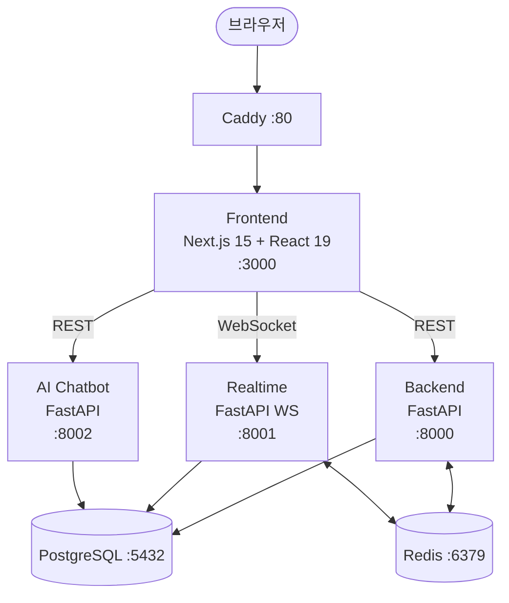
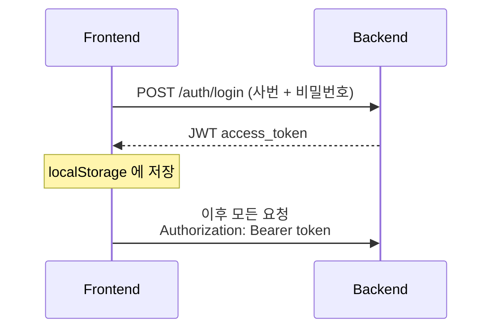

# 시스템 아키텍처

## 서비스 구성도



## 데이터 흐름

### 인증 흐름



### 실시간 채팅 흐름
1. Frontend → WebSocket 연결: `ws://realtime:8001/ws/chat/{channel_id}?token=<jwt>`
2. 메시지 전송 → Realtime 서버가 Redis Pub/Sub으로 브로드캐스트
3. 같은 채널의 모든 연결된 클라이언트에게 전달

### AI 챗봇 흐름
1. 사용자 질문 → `POST /api/chat/`
2. AI Chatbot 서버가 LLM API 호출
3. 응답 반환

## 브라우저에서 들어오는 길

실제 접속은 Caddy(80)를 거친다. Caddy가 프론트엔드(3000)로 넘기고, 프론트엔드의 `/backend/*`
재작성 규칙이 백엔드(8000)로 보낸다. 그래서 사용자는 `http://localhost` 하나만 쓰면 된다.

```
브라우저 → Caddy :80 → Frontend :3000 ──(/backend/* 재작성)──> Backend :8000
```

## 폴더별 역할

서비스별 폴더 구조는 [README](../README.md#폴더-구조)에 정리돼 있다.
